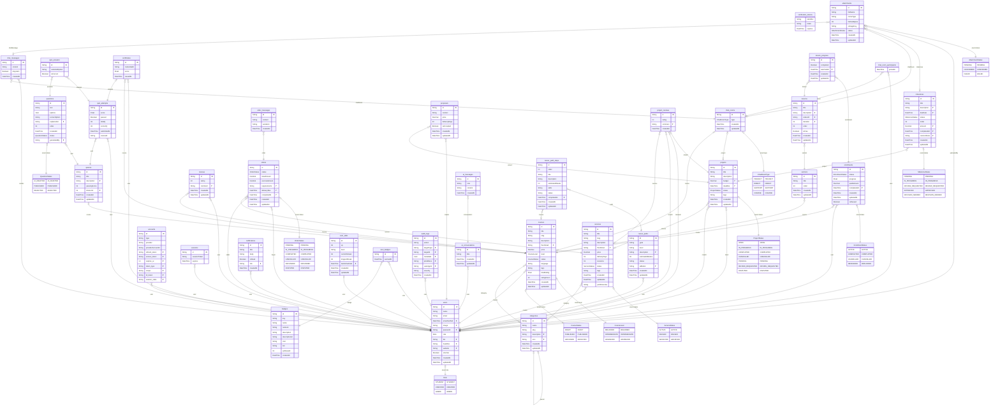

```mermaid
erDiagram

        Role {
            STUDENT STUDENT
CREATOR CREATOR
ADMIN ADMIN
        }
    


        CourseLevel {
            BEGINNER BEGINNER
INTERMEDIATE INTERMEDIATE
ADVANCED ADVANCED
        }
    


        CourseStatus {
            DRAFT DRAFT
PUBLISHED PUBLISHED
ARCHIVED ARCHIVED
        }
    


        EnrollmentStatus {
            ACTIVE ACTIVE
COMPLETED COMPLETED
CANCELLED CANCELLED
REFUNDED REFUNDED
        }
    


        ServiceStatus {
            ACTIVE ACTIVE
PAUSED PAUSED
ARCHIVED ARCHIVED
        }
    


        OrderStatus {
            PENDING PENDING
IN_PROGRESS IN_PROGRESS
COMPLETED COMPLETED
CANCELLED CANCELLED
REFUNDED REFUNDED
DISPUTED DISPUTED
        }
    


        ProjectStatus {
            OPEN OPEN
IN_PROGRESS IN_PROGRESS
COMPLETED COMPLETED
CANCELLED CANCELLED
PENDING PENDING
REVIEW_REQUESTED REVIEW_REQUESTED
DISPUTED DISPUTED
        }
    


        MilestoneStatus {
            PENDING PENDING
IN_PROGRESS IN_PROGRESS
REVIEW_REQUESTED REVIEW_REQUESTED
APPROVED APPROVED
REVISION_NEEDED REVISION_NEEDED
        }
    


        ChatRoomType {
            PROJECT PROJECT
DIRECT DIRECT
SUPPORT SUPPORT
COURSE COURSE
        }
    


        AttachmentStatus {
            PENDING PENDING
CONFIRMED CONFIRMED
FAILED FAILED
        }
    


        QuestionStatus {
            AI_DRAFTED AI_DRAFTED
PUBLISHED PUBLISHED
REJECTED REJECTED
        }
    
  "users" {
    String id "🗝️"
    String name 
    String email 
    DateTime emailVerified "❓"
    String image "❓"
    String password "❓"
    Role role 
    String bio "❓"
    String headline "❓"
    String website "❓"
    Boolean isActive 
    DateTime createdAt 
    DateTime updatedAt 
    }
  

  "accounts" {
    String id "🗝️"
    String type 
    String provider 
    String providerAccountId 
    String refresh_token "❓"
    String access_token "❓"
    Int expires_at "❓"
    String token_type "❓"
    String scope "❓"
    String id_token "❓"
    String session_state "❓"
    }
  

  "sessions" {
    String id "🗝️"
    String sessionToken 
    DateTime expires 
    }
  

  "verification_tokens" {
    String identifier 
    String token 
    DateTime expires 
    }
  

  "categories" {
    String id "🗝️"
    String name 
    String slug 
    String description "❓"
    String icon "❓"
    DateTime createdAt 
    DateTime updatedAt 
    }
  

  "courses" {
    String id "🗝️"
    String title 
    String slug 
    String description 
    String thumbnail "❓"
    Decimal price 
    CourseLevel level 
    CourseStatus status 
    String language 
    String tags 
    Float totalRating 
    Int ratingCount 
    DateTime createdAt 
    DateTime updatedAt 
    }
  

  "quizzes" {
    String id "🗝️"
    String title 
    String description "❓"
    Int passingScore 
    Int timeLimit "❓"
    DateTime createdAt 
    DateTime updatedAt 
    }
  

  "questions" {
    String id "🗝️"
    String text 
    Json options 
    String correctOption 
    String explanation "❓"
    Int order 
    DateTime createdAt 
    QuestionStatus status 
    String generatedBy "❓"
    }
  

  "quiz_attempts" {
    String id "🗝️"
    Float score 
    Boolean passed 
    Int totalQ 
    Int correctQ 
    DateTime submittedAt 
    String courseId 
    }
  

  "quiz_answers" {
    String id "🗝️"
    String selectedOption 
    Boolean isCorrect 
    }
  

  "certificates" {
    String id "🗝️"
    String credentialId 
    Float score 
    DateTime issuedAt 
    }
  

  "sections" {
    String id "🗝️"
    String title 
    Int order 
    DateTime createdAt 
    DateTime updatedAt 
    }
  

  "lessons" {
    String id "🗝️"
    String title 
    String description "❓"
    String videoUrl "❓"
    Int duration "❓"
    Int order 
    Boolean isFree 
    DateTime createdAt 
    DateTime updatedAt 
    }
  

  "enrollments" {
    String id "🗝️"
    EnrollmentStatus status 
    Float progress 
    Decimal paidAmount 
    DateTime completedAt "❓"
    DateTime createdAt 
    DateTime updatedAt 
    Boolean isPassed 
    }
  

  "lesson_progress" {
    String id "🗝️"
    Boolean completed 
    DateTime watchedAt "❓"
    DateTime createdAt 
    DateTime updatedAt 
    }
  

  "reviews" {
    String id "🗝️"
    Int rating 
    String comment "❓"
    DateTime createdAt 
    DateTime updatedAt 
    }
  

  "services" {
    String id "🗝️"
    String title 
    String slug 
    String description 
    String thumbnail "❓"
    Decimal price 
    Int deliveryDays 
    Int revisions 
    ServiceStatus status 
    String tags 
    DateTime createdAt 
    DateTime updatedAt 
    String portfolioLinks 
    }
  

  "milestones" {
    String id "🗝️"
    String title 
    String description "❓"
    DateTime dueDate "❓"
    MilestoneStatus status 
    Int order 
    Decimal amount "❓"
    DateTime completedAt "❓"
    String revisionNote "❓"
    DateTime createdAt 
    DateTime updatedAt 
    }
  

  "chat_rooms" {
    String id "🗝️"
    ChatRoomType type 
    DateTime createdAt 
    DateTime updatedAt 
    }
  

  "chat_room_participants" {
    DateTime joinedAt 
    }
  

  "chat_messages" {
    String id "🗝️"
    String content 
    Boolean isSystem 
    DateTime createdAt 
    }
  

  "orders" {
    String id "🗝️"
    OrderStatus status 
    Decimal totalAmount 
    Decimal escrowAmount 
    String requirements "❓"
    DateTime deliveryDue "❓"
    DateTime completedAt "❓"
    DateTime createdAt 
    DateTime updatedAt 
    }
  

  "order_messages" {
    String id "🗝️"
    String content 
    String senderId 
    DateTime createdAt 
    }
  

  "projects" {
    String id "🗝️"
    String title 
    String description 
    Decimal budget "❓"
    DateTime deadline "❓"
    ProjectStatus status 
    String tags 
    DateTime createdAt 
    DateTime updatedAt 
    }
  

  "proposals" {
    String id "🗝️"
    String content 
    Decimal price 
    Int deliveryDays 
    Boolean isAccepted 
    DateTime createdAt 
    DateTime updatedAt 
    }
  

  "notifications" {
    String id "🗝️"
    String title 
    String body 
    Boolean isRead 
    String link "❓"
    DateTime createdAt 
    }
  

  "attachments" {
    String id "🗝️"
    String fileName 
    String mimeType 
    Int fileSizeBytes 
    String storageKey 
    AttachmentStatus status 
    DateTime createdAt 
    DateTime updatedAt 
    }
  

  "ai_conversations" {
    String id "🗝️"
    String title 
    DateTime createdAt 
    DateTime updatedAt 
    }
  

  "ai_messages" {
    String id "🗝️"
    String role 
    String content 
    DateTime createdAt 
    }
  

  "career_paths" {
    String id "🗝️"
    String goal 
    String level 
    String description "❓"
    Int estimatedWeeks 
    String status 
    String aiModel "❓"
    DateTime createdAt 
    DateTime updatedAt 
    }
  

  "career_path_steps" {
    String id "🗝️"
    Int order 
    String title 
    String description 
    Int estimatedWeeks 
    String skills 
    String status 
    DateTime completedAt "❓"
    DateTime createdAt 
    DateTime updatedAt 
    }
  

  "user_stats" {
    String id "🗝️"
    Int xp 
    String level 
    Int currentStreak 
    Int longestStreak 
    DateTime lastActiveDate "❓"
    DateTime createdAt 
    DateTime updatedAt 
    }
  

  "badges" {
    String id "🗝️"
    String key 
    String name 
    String nameAr 
    String description 
    String descriptionAr 
    String icon 
    String tier 
    Int xpReward 
    DateTime createdAt 
    }
  

  "user_badges" {
    String id "🗝️"
    DateTime earnedAt 
    }
  

  "audit_logs" {
    String id "🗝️"
    String action 
    String targetType "❓"
    String targetId "❓"
    Json metadata "❓"
    String ipAddress "❓"
    String userAgent "❓"
    String severity 
    DateTime createdAt 
    }
  

  "project_reviews" {
    String id "🗝️"
    Int rating 
    String comment "❓"
    DateTime createdAt 
    }
  
    "users" |o--|| "Role" : "enum:role"
    "accounts" }o--|| "users" : "user"
    "sessions" }o--|| "users" : "user"
    "categories" |o--|o "categories" : "parent"
    "courses" |o--|| "CourseLevel" : "enum:level"
    "courses" |o--|| "CourseStatus" : "enum:status"
    "courses" }o--|| "users" : "creator"
    "courses" }o--|o "categories" : "category"
    "quizzes" |o--|| "courses" : "course"
    "questions" }o--|| "quizzes" : "quiz"
    "questions" |o--|| "QuestionStatus" : "enum:status"
    "quiz_attempts" }o--|| "users" : "user"
    "quiz_attempts" }o--|| "quizzes" : "quiz"
    "quiz_answers" }o--|| "quiz_attempts" : "attempt"
    "quiz_answers" }o--|| "questions" : "question"
    "certificates" }o--|| "users" : "user"
    "certificates" }o--|| "courses" : "course"
    "certificates" |o--|| "quiz_attempts" : "attempt"
    "sections" }o--|| "courses" : "course"
    "lessons" }o--|| "sections" : "section"
    "enrollments" |o--|| "EnrollmentStatus" : "enum:status"
    "enrollments" }o--|| "users" : "user"
    "enrollments" }o--|| "courses" : "course"
    "lesson_progress" }o--|| "enrollments" : "enrollment"
    "lesson_progress" }o--|| "lessons" : "lesson"
    "reviews" }o--|| "users" : "user"
    "reviews" }o--|| "courses" : "course"
    "services" |o--|| "ServiceStatus" : "enum:status"
    "services" }o--|| "users" : "creator"
    "services" }o--|o "categories" : "category"
    "milestones" |o--|| "MilestoneStatus" : "enum:status"
    "milestones" }o--|| "projects" : "project"
    "chat_rooms" |o--|| "ChatRoomType" : "enum:type"
    "chat_rooms" |o--|o "projects" : "project"
    "chat_rooms" |o--|o "courses" : "course"
    "chat_room_participants" }o--|| "users" : "user"
    "chat_room_participants" }o--|| "chat_rooms" : "chatRoom"
    "chat_messages" }o--|| "users" : "sender"
    "chat_messages" }o--|| "chat_rooms" : "chatRoom"
    "orders" |o--|| "OrderStatus" : "enum:status"
    "orders" }o--|| "users" : "buyer"
    "orders" }o--|| "users" : "seller"
    "orders" }o--|| "services" : "service"
    "order_messages" }o--|| "orders" : "order"
    "projects" |o--|| "ProjectStatus" : "enum:status"
    "projects" }o--|| "users" : "client"
    "projects" }o--|o "users" : "creator"
    "projects" }o--|o "services" : "service"
    "proposals" }o--|| "users" : "creator"
    "proposals" }o--|| "projects" : "project"
    "notifications" }o--|| "users" : "user"
    "attachments" |o--|| "AttachmentStatus" : "enum:status"
    "attachments" }o--|| "users" : "uploadedBy"
    "attachments" }o--|o "milestones" : "milestone"
    "attachments" }o--|o "chat_rooms" : "chatRoom"
    "attachments" }o--|o "chat_messages" : "chatMessage"
    "ai_conversations" }o--|| "users" : "user"
    "ai_messages" }o--|| "ai_conversations" : "conversation"
    "career_paths" }o--|| "users" : "user"
    "career_path_steps" }o--|| "career_paths" : "path"
    "career_path_steps" }o--|o "courses" : "course"
    "user_stats" |o--|| "users" : "user"
    "user_badges" }o--|| "users" : "user"
    "user_badges" }o--|| "badges" : "badge"
    "audit_logs" }o--|o "users" : "user"
    "project_reviews" |o--|| "projects" : "project"
    "project_reviews" }o--|| "users" : "reviewer"
    "project_reviews" }o--|| "users" : "creator"
    "project_reviews" }o--|o "services" : "service"
```
